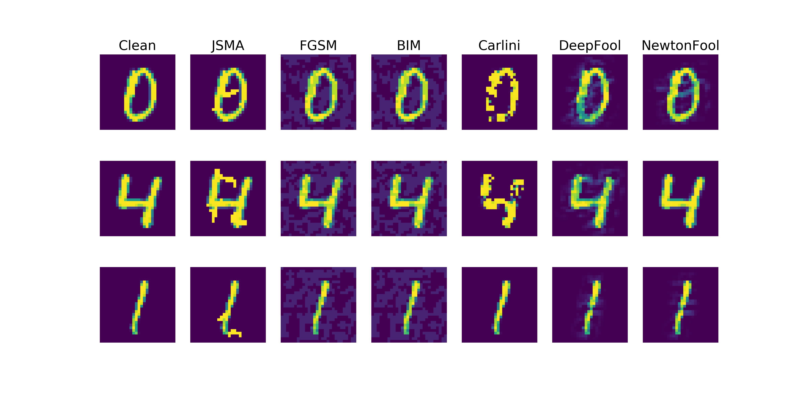
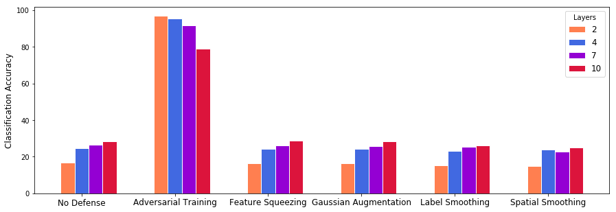

# Evaluating the Landscape of Adversarial Attacks and Defenses
*Authors:* Kevin Chen, Dexter Lee, Jacob Steen, Shivang Patel

## Prerequisites
- python 3.6+
- Tensorflow
- Keras
- numpy
- pandas
- IBM Adversarial Training Robustness Toolbox

## Implementations
### Attacks:
- Fast Gradient Sign Method
- Jacobian Saliency Map Attack
- DeepFool
- NewtonFool
- Carlini L2 Attack
- Basic Iterative Method
- Universal Perturbation

### Defenses:
- Feature Squeezing
- Spacial Smoothing
- Gaussian Augmentation
- Label Smoothing
- Adversarial Training

### Neural Network Architectures:
- 2-Layer Fully-Connected Feed-Forward Neural Network
- 4-Layer Fully-Connected Feed-Forward Neural Network
- 7-Layer Fully-Connected Feed-Forward Neural Network
- 10-Layer Fully-Connected Feed-Forward Neural Network
- 1-Layer Convolutional Neural Nework with Maxpooling and Dropout
- 2-Layer Convolutional Neural Nework with Maxpooling and Dropout
